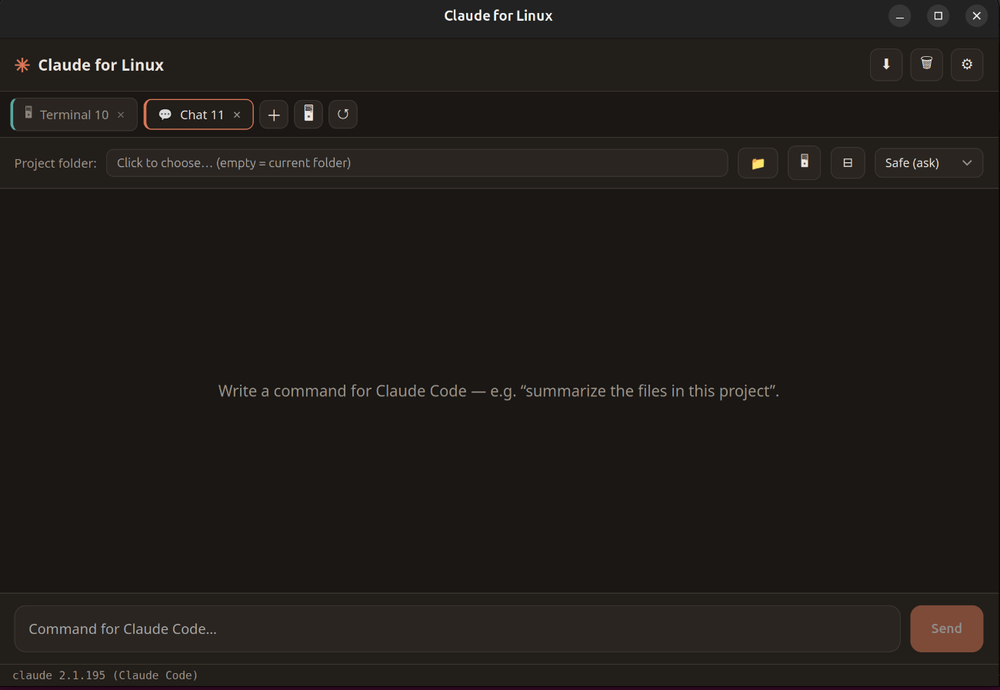

<div align="center">

# Claude for Linux

**A lightweight, open-source desktop GUI for [Claude Code](https://docs.claude.com/en/docs/claude-code) on Linux.**

Tabs, persistent conversations, Markdown/code rendering, drag-and-drop, and one-click terminal — all on top of the `claude` CLI you already use.

[](LICENSE)


### 🌐 [Website](https://aminasaadi80.github.io/claude-for-linux/) · ⬇ [Download](../../releases/latest) · 💻 [GitHub](https://github.com/aminasaadi80/claude-for-linux)

</div>

> **It uses your existing Claude Code login.** No API key, no extra cost — the app drives the local `claude` CLI, so it authenticates with the same browser login you already use in the terminal, and runs on your existing subscription.

---

## ✨ Features

- 🗂 **Multiple tabs** — run several independent Claude Code sessions side by side.
- 💾 **Persistent sessions** — close and reopen the app; your conversations are still there and resumable (`--resume`).
- 🧠 **Continuous context** — each tab keeps its session, so follow-up messages remember the conversation.
- 🎨 **Markdown + syntax-highlighted code** — readable output instead of raw text.
- 🔧 **Tool activity** — see `Read` / `Edit` / `Bash` steps as Claude works.
- 🔒 **Permission modes** — Safe / Accept edits / Full access, per tab.
- ⏹ **Stop button** — cancel a running request instantly.
- 📁 **Native folder picker** + 🖥 **open a terminal** at the project folder in one click.
- 📎 **Drag & drop** files to insert their paths into the prompt.
- 🌐 **Bilingual UI** — English / فارسی, switchable at runtime.

## 📸 Screenshot

<div align="center">

</div>

## 📦 Install

### Prerequisites

You need the **Claude Code CLI** installed and logged in:

```bash
# if you don't have it yet
curl -fsSL https://claude.ai/install.sh | bash   # or: npm i -g @anthropic-ai/claude-code
claude        # run once and complete the browser login
```

### Option A — Debian/Ubuntu package

Download the `.deb` from [Releases](../../releases) and:

```bash
sudo dpkg -i "Claude for Linux_*_amd64.deb"
```

Then launch **Claude for Linux** from your applications menu.

### Option B — AppImage (portable, any distro)

Download the `.AppImage` from [Releases](../../releases), then:

```bash
chmod +x "Claude for Linux_*_amd64.AppImage"
./"Claude for Linux_*_amd64.AppImage"
```

### Option C — macOS (.dmg)

Download the universal `.dmg` (Apple Silicon + Intel) from [Releases](../../releases), open it and drag the app to **Applications**.

The build is **unsigned** (no paid Apple Developer certificate), so on first launch macOS Gatekeeper will block it. Either **right-click the app → Open**, or clear the quarantine flag:

```bash
xattr -cr "/Applications/Claude for Linux.app"
```

## 🛠 Build from source

Requires **Node.js**, **Rust** (rustup), and the Tauri Linux system libraries.

```bash
# 1. System libraries (Debian/Ubuntu)
sudo apt install -y libwebkit2gtk-4.1-dev build-essential curl wget file \
  libxdo-dev libssl-dev libayatana-appindicator3-dev librsvg2-dev

# 2. Build & run
npm install
npm run tauri dev      # development
npm run tauri build    # produces .deb + .AppImage in src-tauri/target/release/bundle/
```

## ⚙️ How it works

The app is a thin GUI over the official CLI. Each message runs:

```
claude -p "<your prompt>" --output-format stream-json --verbose \
  [--resume <session-id>] [--permission-mode <mode>]
```

and streams the JSON events back into the UI (text, tool calls, session id). Because it shells out to `claude`, **it inherits your CLI authentication and uses no API key.**

> **GUI vs. terminal:** the app focuses on convenience (tabs, history, rendering). The terminal `claude` is fully interactive (live permission prompts, slash commands, plan mode) — the two are complementary and share the same engine.

## 🧰 Tech stack

[Tauri 2](https://tauri.app) (Rust) · [React](https://react.dev) + TypeScript · Vite

## 📄 License

[MIT](LICENSE) © Amin Asaadi — [aminasaadi.ir](https://aminasaadi.ir)

---

<div align="center">
<sub>Not affiliated with or endorsed by Anthropic. “Claude” is a trademark of Anthropic; this is an independent, unofficial client.</sub>
</div>
